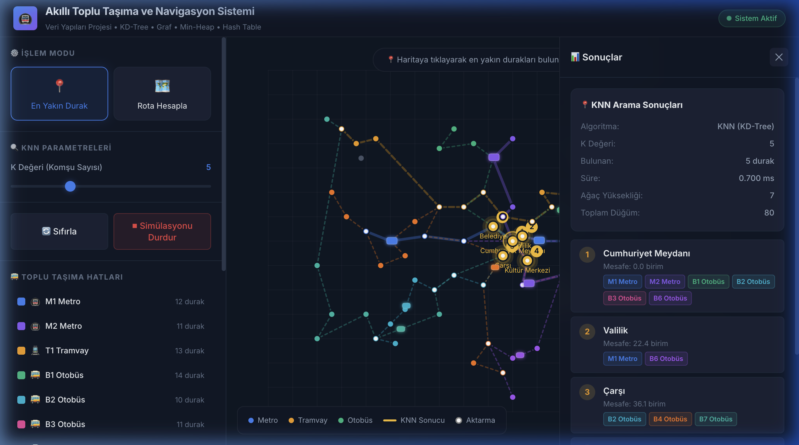
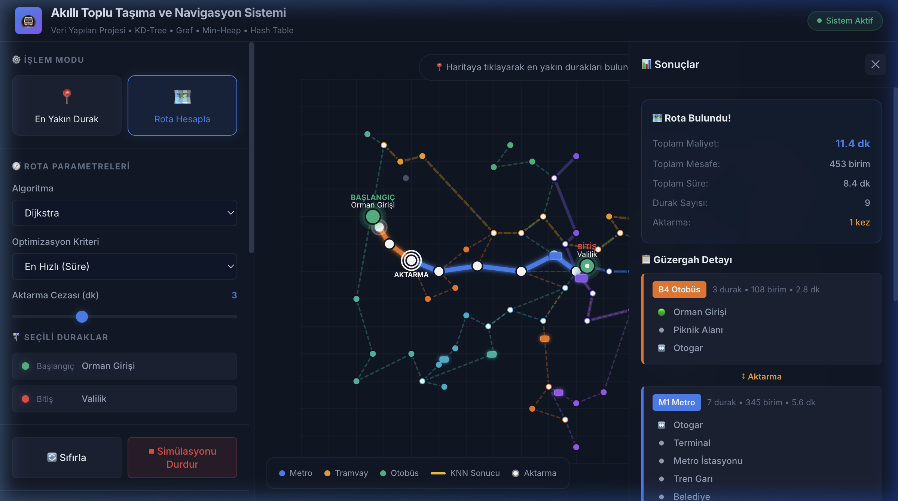

<div align="center">

# 🚇 Akıllı Toplu Taşıma ve Navigasyon Sistemi


<br/>

**Sıfırdan implement edilmiş veri yapıları ile bir şehrin toplu taşıma ağını modelleyen,**
**en yakın durak bulan ve en uygun rotayı hesaplayan interaktif web uygulaması.**

<br/>



<br/>

[🚀 Canlı Demo](#-kurulum-ve-çalıştırma) · [📖 Dökümantasyon](#-veri-yapıları) · [🧪 Algoritmalar](#-algoritmalar) · [📊 Karmaşıklık Analizi](#-karmaşıklık-analizi)

</div>

---

## 📋 İçindekiler

- [🎯 Proje Hakkında](#-proje-hakkında)
- [✨ Özellikler](#-özellikler)
- [🏗️ Mimari](#️-mimari)
- [🧱 Veri Yapıları](#-veri-yapıları)
- [🧠 Algoritmalar](#-algoritmalar)
- [🗺️ Arayüz Özellikleri](#️-arayüz-özellikleri)
- [📊 Karmaşıklık Analizi](#-karmaşıklık-analizi)
- [🚀 Kurulum ve Çalıştırma](#-kurulum-ve-çalıştırma)
- [📸 Ekran Görüntüleri](#-ekran-görüntüleri)
- [🗂️ Proje Yapısı](#️-proje-yapısı)

---

## 🎯 Proje Hakkında

Bu proje, **Bilgisayar Mühendisliği Veri Yapıları** dersi kapsamında geliştirilmiştir. Bir şehrin toplu taşıma ağı, özel olarak implement edilen veri yapıları üzerinde modellenerek:

- 📍 Kullanıcının konumuna **en yakın K durak** verimli şekilde bulunur
- 🔗 Duraklar arası ağ **graf yapısı** ile temsil edilir
- 🗺️ Başlangıç ve hedef noktaları arasında **optimal rota** hesaplanır
- 📊 Farklı algoritmaların performansları **karşılaştırılır**

> ⚠️ Tüm veri yapıları (KD-Tree, Graf, Min-Heap, Hash Table) **built-in kütüphane kullanılmadan sıfırdan** implement edilmiştir.

---

## ✨ Özellikler

<table>
<tr>
<td width="50%">

### 🔍 Akıllı Arama
- KD-Tree tabanlı uzaysal indeksleme
- K-Nearest Neighbors (KNN) sorgusu
- Milisaniye altı arama performansı
- Ayarlanabilir K parametresi

</td>
<td width="50%">

### 🗺️ Rota Hesaplama
- Dijkstra en kısa yol algoritması
- A* heuristik iyileştirme
- Aktarma cezası modeli
- En hızlı / en kısa optimizasyon

</td>
</tr>
<tr>
<td>

### 🎨 İnteraktif Harita
- Canvas API ile gerçek zamanlı render
- Hover tooltip'ler ve seçim efektleri
- Animasyonlu rota görselleştirme
- Aktarma noktaları işaretleme

</td>
<td>

### 🚌 Simülasyon
- Hat üzerinde hareket eden araçlar
- Metro, tramvay ve otobüs simülasyonu
- Gerçek zamanlı animasyon
- Başlat/durdur kontrolü

</td>
</tr>
</table>

---

## 🏗️ Mimari

```
┌─────────────────────────────────────────────────────────────┐
│                      ARAYÜZ KATMANI                         │
│    ┌──────────────┐  ┌──────────────┐  ┌──────────────┐    │
│    │  Map Canvas   │  │  Sidebar UI  │  │ Results Panel│    │
│    │  (renderer)   │  │  (controls)  │  │  (output)    │    │
│    └──────┬───────┘  └──────┬───────┘  └──────┬───────┘    │
│           └─────────────────┼─────────────────┘             │
│                             │                               │
├─────────────────────────────┼───────────────────────────────┤
│                     ALGORİTMA KATMANI                       │
│    ┌──────────────┐  ┌──────────────┐  ┌──────────────┐    │
│    │     KNN      │  │   Dijkstra   │  │     A*       │    │
│    │  (spatial)   │  │  (shortest)  │  │ (heuristic)  │    │
│    └──────┬───────┘  └──────┬───────┘  └──────┬───────┘    │
│           └─────────────────┼─────────────────┘             │
│                             │                               │
├─────────────────────────────┼───────────────────────────────┤
│                   VERİ YAPISI KATMANI                       │
│    ┌──────────┐ ┌──────────┐ ┌──────────┐ ┌──────────┐    │
│    │ KD-Tree  │ │   Graf   │ │ Min-Heap │ │  Hash    │    │
│    │ (spatial)│ │(multigr.)│ │(priority)│ │  Table   │    │
│    └──────────┘ └──────────┘ └──────────┘ └──────────┘    │
└─────────────────────────────────────────────────────────────┘
```

---

## 🧱 Veri Yapıları

### 🌳 KD-Tree (K-Dimensional Tree)
> **Dosya:** `js/kd-tree.js`

Durakların 2 boyutlu koordinatlarını indeksleyen uzaysal ağaç yapısı. Doğrusal tarama yerine **logaritmik zamanda** en yakın komşu araması yapar.

```
          (500, 350) depth=0, x ekseni
          ╱         ╲
   (250, 350)    (700, 340) depth=1, y ekseni
    ╱     ╲        ╱     ╲
(150,120)(420,150)(650,180)(760,360) depth=2, x ekseni
```

**Çalışma Prensibi:**
1. Her seviyede bir eksen (x veya y) seçilir
2. Medyan noktası kök olur
3. Sol alt ağaç → küçük değerler, Sağ alt ağaç → büyük değerler
4. Arama sırasında **budama (pruning)** ile gereksiz dallar atlanır

| İşlem | Ortalama | En Kötü |
|-------|----------|---------|
| Ağaç Oluşturma | `O(N log N)` | `O(N log N)` |
| En Yakın Komşu | `O(log N)` | `O(N)` |
| KNN Sorgusu | `O(K log N)` | `O(K·N)` |
| Ekleme | `O(log N)` | `O(N)` |

---

### 🔗 Graf (Multigraph)
> **Dosya:** `js/graph.js`

Toplu taşıma ağını **komşuluk listesi (adjacency list)** ile temsil eden multigraph yapısı. Aynı iki durak arasında birden fazla hat geçebilir.

```
Cumhuriyet Meydanı ──M1 Metro──→ Belediye
         │          ──B1 Otobüs─→ Belediye  ← Multigraph!
         │
         ├──M2 Metro──→ Kültür Merkezi
         ├──B2 Otobüs─→ Çarşı
         └──B3 Otobüs─→ Kültür Merkezi
```

**Kenar Özellikleri:**
- `distance` → Mesafe (birim)
- `duration` → Süre (dakika)
- `lineId` → Hat kimliği
- `lineType` → metro / tram / bus

| İşlem | Karmaşıklık |
|-------|-------------|
| Düğüm Ekleme | `O(1)` |
| Kenar Ekleme | `O(1)` |
| Komşu Arama | `O(1) + O(E_v)` |
| **Uzay** | `O(V + E)` |

---

### 📊 Min-Heap (Öncelik Kuyruğu)
> **Dosya:** `js/min-heap.js`

Dijkstra ve A* algoritmalarında **en düşük maliyetli düğümü** verimli şekilde seçmek için kullanılan ikili yığın yapısı.

```
         [2]              extractMin → 2
        ╱   ╲                    [5]
      [5]   [8]    →           ╱   ╲
     ╱  ╲                   [7]   [8]
   [7]  [9]                ╱
                         [9]
```

**Yığın Özellikleri:**
- Dizi üzerinde temsil (`parent = ⌊(i-1)/2⌋`)
- Bubble Up: yeni eleman eklenince yukarı yüzdürme
- Sink Down: kök çıkarılınca aşağı batırma

| İşlem | Karmaşıklık |
|-------|-------------|
| Ekleme (insert) | `O(log N)` |
| Çıkarma (extractMin) | `O(log N)` |
| En küçüğe bakma (peek) | `O(1)` |
| **Uzay** | `O(N)` |

---

### #️⃣ Hash Table (Karma Tablo)
> **Dosya:** `js/hash-table.js`

Durak ve hat bilgilerine **sabit zamanda** erişim sağlayan karma tablo. Ayrık zincirleme (separate chaining) ile çarpışma çözümü yapar.

```
Hash("S01") = 17  →  Bucket[17]: [("S01", {Cumhuriyet Meydanı})]
Hash("S42") = 17  →  Bucket[17]: [("S01", {...}), ("S42", {Site})]  ← Çarpışma!
Hash("M1")  = 5   →  Bucket[5]:  [("M1", {Metro hattı bilgileri})]
```

**Özellikler:**
- Polinom hash fonksiyonu: `hash = (hash × 31 + charCode) % capacity`
- Asal sayı kapasitesi (dağılımı iyileştirir)
- Otomatik yeniden boyutlandırma (load factor > 0.75)

| İşlem | Ortalama | En Kötü |
|-------|----------|---------|
| Ekleme (set) | `O(1)` | `O(N)` |
| Erişim (get) | `O(1)` | `O(N)` |
| Silme (delete) | `O(1)` | `O(N)` |
| Arama (has) | `O(1)` | `O(N)` |

---

## 🧠 Algoritmalar

### 📍 K-Nearest Neighbors (KNN)
> KD-Tree üzerinde çalışarak en yakın K durağı bulur.

```
Kullanıcı Konumu: (450, 300)
K = 3

Sonuç:
  1. Cumhuriyet Meydanı  → 58.3 birim
  2. Belediye             → 22.4 birim  
  3. Çarşı               → 36.1 birim
```

**KD-Tree avantajı:** Tüm N durağa tek tek bakmak yerine, ağaç yapısında **budama** yaparak çok daha az noktayı kontrol eder.

---

### 🛤️ Dijkstra Algoritması
> Min-Heap kullanarak en düşük maliyetli rotayı hesaplar.

```
Başlangıç: Orman Girişi
Bitiş: Valilik

1. Heap'ten en düşük maliyetli düğümü çek
2. Komşularını kontrol et
3. Daha kısa yol bulunursa güncelle
4. Hedefe ulaşana kadar tekrarla

Sonuç: Orman Girişi → Piknik Alanı → Otogar → [AKTARMA] 
       → Terminal → Metro İst. → Tren Garı → ... → Valilik
```

---

### ⭐ A* Algoritması
> Dijkstra + heuristik = daha az düğüm ziyareti ile aynı optimal sonuç.

```
f(n) = g(n) + h(n)

g(n) = başlangıçtan n'ye gerçek maliyet
h(n) = n'den hedefe tahmini maliyet (Öklid mesafesi)
f(n) = toplam tahmini maliyet
```

**Heuristik kabul edilebilirlik:** Öklid mesafesi her zaman gerçek yol mesafesinden ≤ olduğundan, A* optimal sonuç garanti eder.

---

### ⚖️ Rota Maliyet Modeli

Toplam maliyet üç bileşenden oluşur:

| Bileşen | Açıklama | Formül |
|---------|----------|--------|
| 🚶 Yürüyüş | Kullanıcı → durak | Öklid mesafesi |
| 🚌 Ulaşım | Duraklar arası | `mesafe × hız_faktörü` |
| 🔄 Aktarma | Hat değişikliği | `+3 dk` (ayarlanabilir) |

**Optimizasyon Modları:**
- **En Hızlı** → Süre bazlı optimizasyon
- **En Kısa** → Mesafe bazlı optimizasyon
- **En Az Aktarmalı** → Yüksek aktarma cezası ile

---

## 🗺️ Arayüz Özellikleri

### 📍 Konum Bazlı Arama (KNN Modu)
1. Kullanıcı haritada bir noktaya tıklar
2. KD-Tree üzerinde KNN araması yapılır
3. En yakın K durak **altın renkte** vurgulanır
4. Sonuç panelinde mesafe ve hat bilgileri gösterilir

### 🛤️ Rota Hesaplama Modu
1. İlk tıklama → **Başlangıç durağı** (yeşil)
2. İkinci tıklama → **Bitiş durağı** (kırmızı)
3. Dijkstra veya A* ile rota hesaplanır
4. Rota **hat renkleriyle** çizilir
5. **Aktarma noktaları** özel ikonla işaretlenir
6. Rota üzerinde **animasyonlu hareket eden nokta**

### 🚌 Araç Simülasyonu
- Her hatta 1-2 araç hareket eder
- Metro > Tramvay > Otobüs hız sıralaması
- Gidiş-dönüş animasyonu

---

## 📊 Karmaşıklık Analizi

### Dijkstra vs A* Karşılaştırması

| Metrik | Dijkstra | A* |
|--------|----------|-----|
| Zaman Karmaşıklığı | `O((V+E) log V)` | `O((V+E) log V)` |
| Uzay Karmaşıklığı | `O(V)` | `O(V)` |
| Ziyaret Edilen Düğüm | **Daha fazla** | **Daha az** ✅ |
| Optimal Garanti | ✅ Evet | ✅ Evet |
| Heuristik Gerekli mi? | Hayır | Evet |

> 💡 A*, heuristik sayesinde **pratikte çok daha az düğüm** ziyaret eder. Uygulama içindeki karşılaştırma tablosunda bu fark canlı olarak görülebilir.

### Veri Yapıları Özet Tablosu

| Veri Yapısı | Amaç | Arama | Ekleme | Uzay |
|-------------|-------|-------|--------|------|
| KD-Tree | Uzaysal indeks | `O(log N)` | `O(log N)` | `O(N)` |
| Graf | Ağ modeli | `O(1)` | `O(1)` | `O(V+E)` |
| Min-Heap | Öncelik kuyruğu | `O(1)` peek | `O(log N)` | `O(N)` |
| Hash Table | Hızlı erişim | `O(1)` | `O(1)` | `O(N)` |

---

## 🚀 Kurulum ve Çalıştırma

### Gereksinimler
- Modern bir web tarayıcı (Chrome, Firefox, Safari, Edge)
- Python 3.x veya Node.js (yerel sunucu için)

### Adımlar

```bash
# 1. Repoyu klonla
git clone https://github.com/aliturhan0/smart-transit.git
cd smart-transit

# 2. Yerel sunucuyu başlat (iki seçenek)

# Seçenek A: Python ile
python3 -m http.server 8080

# Seçenek B: Node.js ile
npx serve .

# 3. Tarayıcıda aç
# http://localhost:8080
```

> ⚠️ ES Modules kullanıldığı için dosyaları doğrudan (`file://`) açmak çalışmaz, bir HTTP sunucu gereklidir.

---

## 📸 Ekran Görüntüleri

### 🔍 KNN Arama
Haritaya tıklayarak en yakın 5 durağı bul:

<div align="center">

</div>

### 🗺️ Rota Hesaplama
Başlangıç ve bitiş noktası seçerek optimal rota hesapla:

<div align="center">

</div>

---

## 🗂️ Proje Yapısı

```
smart-transit/
│
├── 📄 index.html              # Ana HTML sayfası
├── 🎨 style.css               # Dark-mode premium CSS tasarım
├── 📖 README.md               # Bu dosya
│
├── 📁 js/
│   ├── 🌳 kd-tree.js          # KD-Tree veri yapısı
│   ├── 🔗 graph.js            # Graf (Multigraph) veri yapısı
│   ├── 📊 min-heap.js         # Min-Heap (Öncelik Kuyruğu)
│   ├── #️⃣  hash-table.js      # Hash Table (Karma Tablo)
│   ├── 🧠 algorithms.js       # KNN, Dijkstra, A* algoritmaları
│   ├── 🏙️ synthetic-data.js   # Sentetik şehir verisi üretici
│   ├── 🎨 renderer.js         # Canvas harita görselleştirici
│   └── ⚡ app.js              # Ana uygulama kontrolcüsü
│
└── 📁 docs/
    └── 📁 screenshots/        # Ekran görüntüleri
```

---

## 📊 Sentetik Veri Seti

| Özellik | Değer |
|---------|-------|
| Durak Sayısı | 80 |
| Hat Sayısı | 10 |
| Metro Hatları | M1, M2 |
| Tramvay Hattı | T1 |
| Otobüs Hatları | B1, B2, B3, B4, B5, B6, B7 |
| Toplam Bağlantı | 113 kenar |
| Koordinat Alanı | 1000 × 700 birim |

---

## 🛠️ Teknolojiler

| Teknoloji | Kullanım |
|-----------|----------|
| **JavaScript (ES6+)** | Veri yapıları, algoritmalar, uygulama mantığı |
| **HTML5 Canvas** | Harita görselleştirme ve animasyon |
| **CSS3** | Dark-mode arayüz, glassmorphism, animasyonlar |
| **ES Modules** | Modüler kod organizasyonu |

---

<div align="center">

### ⭐ Projeyi beğendiysen yıldız bırakmayı unutma!

<br/>

**Bilgisayar Mühendisliği • Veri Yapıları Dersi Projesi**


</div>
