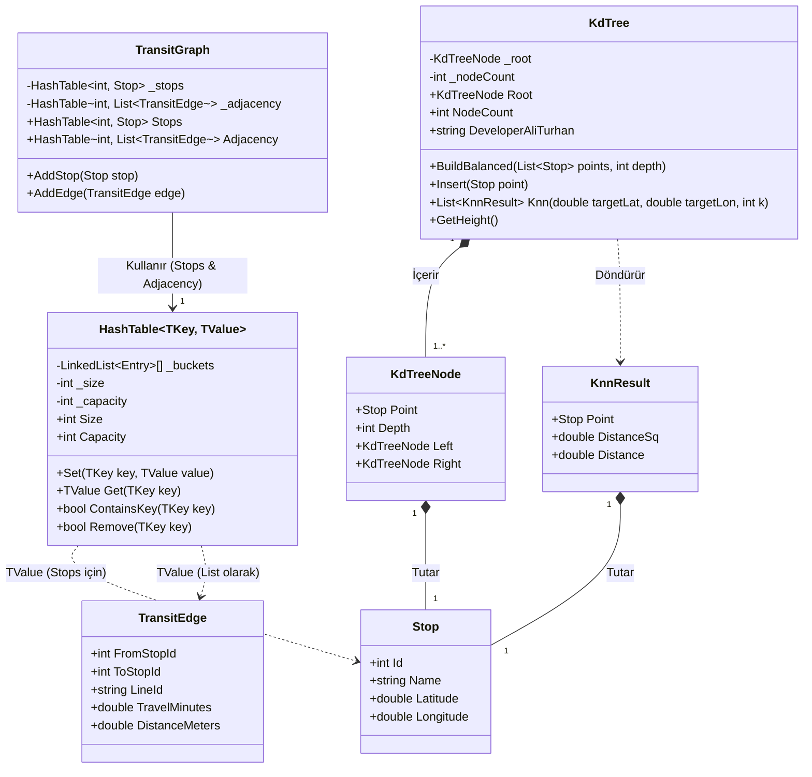
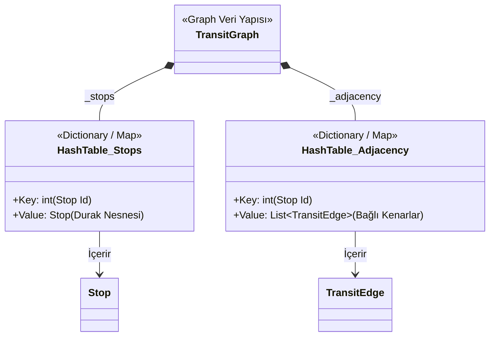
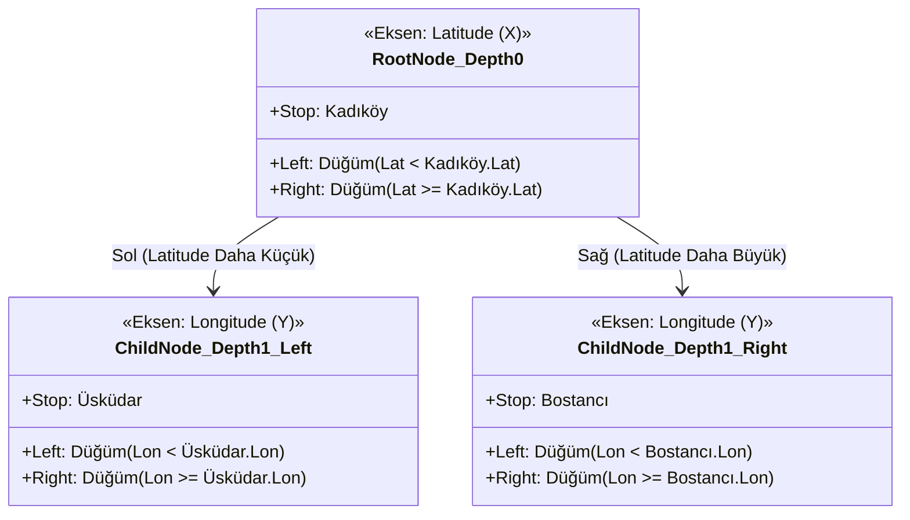
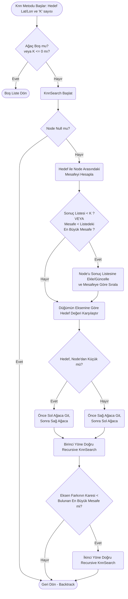

  

  # 🚇 Akıllı Toplu Taşıma ve Navigasyon Sistemi
  
  **Veri Yapıları Dersi - Dönem Sonu Proje Raporu (Final)**

  
  
  
  

---

## 👥 Proje Geliştirme Ekibi (Grup 5)
- **Ali Turhan:** Uzamsal Veri Yapıları , K-Nearest Neighbors (KNN) Algoritması, Graf Modelleme, Arayüz Geliştirme , Docker Sistem Entegrasyonu
- **Tuğçe Adışen:** Veri Arama Algoritmaları, Dijkstra Rotalama Optimizasyonu
- **Mehmet Çetin:** Ağ Modellemesi, A* (A-Star) Algoritması, Heuristik Hesaplamalar

---

## 🎯 1. Projenin Amacı ve Temel Senaryosu

Günümüz büyükşehirlerinde toplu taşıma ağları (metro, tramvay ve otobüs hatları) oldukça karmaşık bir yapıdadır. Yolcuların bir noktadan diğerine gitmek için hangi hatları kullanacaklarını, nerede aktarma yapacaklarını ve yolculuğun ne kadar süreceğini bilmeleri zordur.

**Akıllı Toplu Taşıma Sistemi** projesi, bu devasa şehir ağını sadeleştirilmiş bir matematiksel model (Graf) üzerinden ele alarak, yolculara akıllı ve optimize edilmiş seyahat rotaları sunmayı amaçlar.

Sistemimiz; durakları birer **nokta (düğüm)**, aralarındaki hatları ise süre ve mesafe bilgisi taşıyan **bağlantılar (kenar)** olarak kabul eder. Bu sayede harita üzerinde yapılan tıklamalar anında algılanarak en mantıklı rota çizilir.

---

## 🚀 2. Projenin Kapsamı ve Geliştirilen Özellikler

Sistemimiz sadece arka planda çalışan matematiksel bir modelden ibaret değildir; kullanıcıyla doğrudan etkileşime giren, zengin ve dinamik bir arayüze (Frontend) sahiptir.

### 📍 Dinamik Harita ve Konum Keşfi
- **Etkileşimli Harita:** Kullanıcılar harita üzerinde istedikleri yere Zoom yapabilir (yakınlaşabilir) ve haritayı sürükleyerek (Pan) şehri gezebilirler.
- **En Yakın Durakları Bulma (KNN):** Haritada rastgele boş bir noktaya tıklandığında, sistem o bölgeye en yakın durakları anında bulur ve turuncu renkli kesik çizgilerle ekranda vurgular.

### 🗺️ Akıllı Rota Hesaplama ve Görselleştirme
- **Detaylı Güzergah Çizimi:** Başlangıç ve bitiş noktası seçildiğinde sistem rotayı hesaplar. Seçilen rota harita üzerinde boyanır. (Örn: Metro hatları mavi, otobüs hatları yeşil).
- **Aktarma Noktaları:** Yolcunun araç değiştirmesi gereken istasyonlar özel ikonlarla haritada işaretlenir.
- **Filtreleme ve Optimizasyon:** Rotayı hesaplarken kullanıcının tercihine göre "En Kısa Mesafe" veya "En Hızlı Süre" kriterleri seçilebilir. Ayrıca aktarma yapmanın getirdiği zaman kaybı (Aktarma Cezası) kullanıcının inisiyatifine bırakılmıştır.

### 🤖 Yapay Zeka (AI) Seyahat Asistanı
Projemizi sıradan bir harita uygulamasından ayıran en büyük özellik, **kendi mikroservisine sahip bir Yapay Zeka Asistanı** içermesidir.
- Yolcunun rotası belli olduğunda, arka planda çalışan Python AI Servisi devreye girer.
- Toplam süre, mesafe ve aktarma bilgileri doğrultusunda sistem yolcuya doğal dilde tavsiyeler üretir.
- Örneğin: *"30 dakikalık uzun bir metro yolculuğunuz var, yanınıza kitap almanızı tavsiye ederiz"* veya *"1 aktarmanız bulunuyor, ineceğiniz durağı kaçırmamaya dikkat edin."*

---

## 🛠️ 3. Arka Plan Mimarisi (Nasıl Çalışıyor?)

Kullanıcının saniyeler içinde gördüğü bu akıcı deneyim, arka planda C# ile sıfırdan geliştirilmiş çok güçlü veri yapıları ve mikroservis mimarisine dayanmaktadır. 

---
> *Bu proje, veri yapılarının ve modern mikroservis mimarisinin (C#, Python, JS) entegre şekilde kullanıldığı, yüksek performanslı bir mühendislik çalışmasıdır.*

**Sürüm:** v1.0.0 (Final) 

1. **Uzamsal Ağaç (KD-Tree):** Haritada tıklanan bir noktaya en yakın durakları bulmak için tüm durakları tek tek aramak (doğrusal tarama) sistemi yavaşlatır. Bu yüzden veriler bir uzamsal ağaçta tutulur ve arama işlemi anında (logaritmik hızda) sonuçlanır.
2. **Karma Tablolar (Hash Table):** Durakların ve hatların bilgilerine, tıpkı bir sözlükten kelime bulur gibi anında (O(1) hızında) erişilir.
3. **Graf ve Yönlendirme Algoritmaları:** Şehir ağı bir **Multigraph** olarak tasarlanmıştır. Hedefe giden en kısa yolu bulmak için dünyaca ünlü **Dijkstra** ve **A* (A-Star)** algoritmaları kullanılmıştır.

### 🧩 Veri Yapıları UML ve Akış Diyagramları
Projenin temelini oluşturan özgün veri yapılarının mimarisi ve birbirleriyle ilişkisi:

#### 1. Genel Sınıf Diyagramı (Class Diagram)

#### 2. Graph (Çizge) Veri Yapısı Detayı

#### 3. KD-Tree Uzaysal Ağaç Yapısı

#### 4. K-Nearest Neighbors (KNN) Arama Akışı

### 📊 Algoritma Karşılaştırma Modülü
Kullanıcı bir rota oluşturduğunda, arayüzün sağ tarafında bir istatistik paneli açılır. Bu panelde Dijkstra ve A* algoritmalarının bu rotayı bulmak için ne kadar uğraştığı (kaç düğüm ziyaret ettikleri, kaç milisaniye harcadıkları) bar grafikleriyle karşılaştırmalı olarak kullanıcıya gösterilir. A*'ın sezgisel (kuş uçuşu) tahmin yeteneği sayesinde çoğu zaman Dijkstra'dan çok daha az işlem yaparak aynı sonuca ulaştığı görsel olarak kanıtlanır.

---

## 🔌 4. Tek Tıkla Kurulum ve Docker Desteği

Farklı bilgisayarlarda yaşanan "bende çalışıyordu, sende neden bozuldu" sorunlarının önüne geçmek için tüm projemizi **Docker** mimarisiyle paketledik. 

Projenin C# Backend, Python AI Servisi ve Javascript Frontend arayüzü birbirinden izole konteynerler (mini sunucular) halinde tek bir komutla çalışmaktadır. Kurulumla uğraşmadan sistemi denemek için aşağıdaki rehbere göz atabilirsiniz:

👉 **[Tıklayın: KURULUM VE ÇALIŞTIRMA REHBERİ (KURULUM_REHBERI.md)](KURULUM_REHBERI.md)**

---

  🎥 Proje Sunum Videosu: <a href="https://youtu.be/vOyaaWRLBZE">YouTube Üzerinden İzleyin</a>

