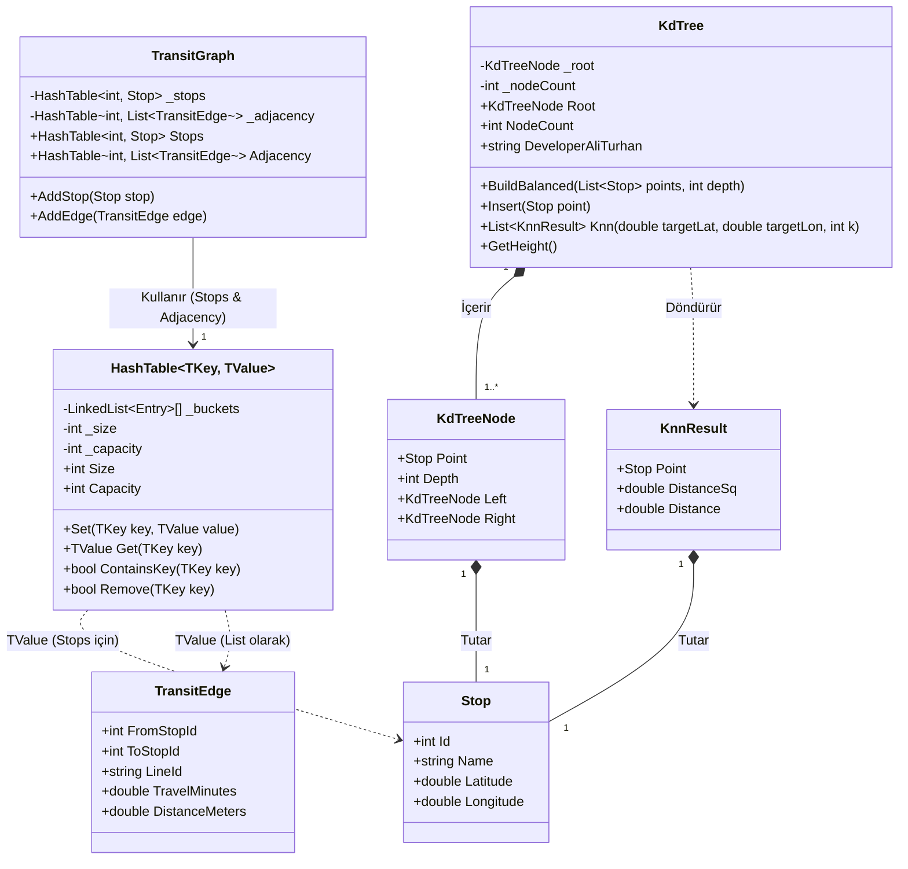
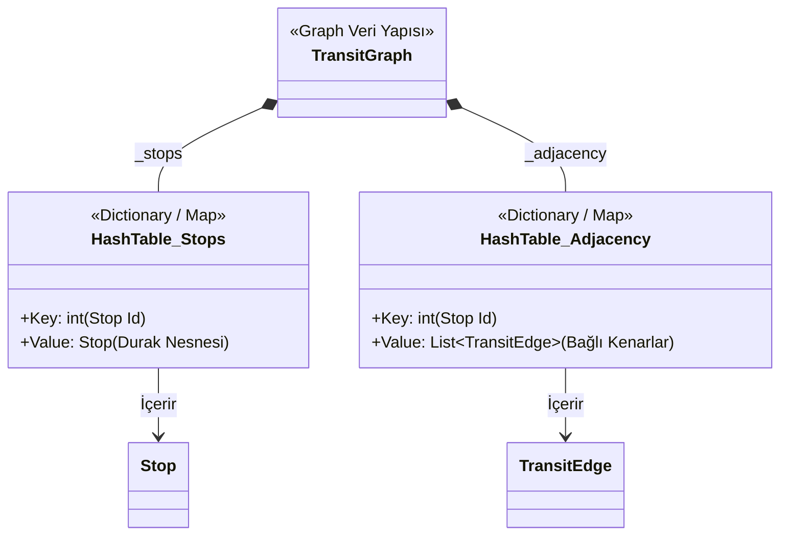
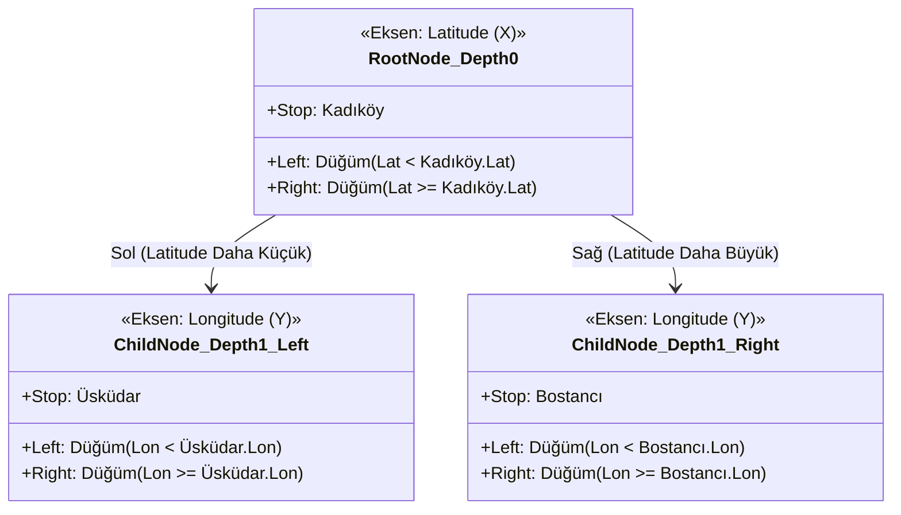
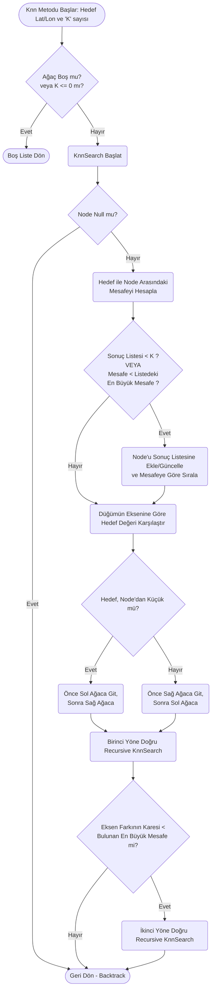

# Smart Transit Projesi UML Diyagramları

İstediğin gibi projeyi ve kurduğun gelişmiş veri yapılarını (Graph, KD-Tree, KNN) detaylıca anlatan UML diyagramlarını hazırladım. Aşağıdaki diyagramlar sistemin Domain katmanının mimarisini, veri ilişkilerini ve algoritmik akışlarını detaylandırmaktadır.

## 1. Genel Sınıf Diyagramı (Class Diagram)
Bu diyagram, sistemdeki temel sınıfları (`TransitGraph`, `Stop`, `TransitEdge`, `KdTree`, `HashTable`) ve birbirleriyle olan sıkı ilişkilerini gösterir.

## 2. Graph (Çizge) Veri Yapısı Detayı
Bu diyagram `TransitGraph` yapısının durakları (`Stop`) ve aralarındaki bağlantıları (`TransitEdge`) kendi yazdığın `HashTable` yapısı içinde nasıl tuttuğunu gösterir.

## 3. KD-Tree Uzaysal Ağaç Yapısı
KD-Tree sınıfının çalışma mantığını ve Depth değerine (Derinliğe) göre eksen değişimini gösteren mantıksal UML yapısı.

## 4. K-Nearest Neighbors (KNN) Arama Akışı
KNN araması yapılırken KD-Tree ağacında mesafelerin nasıl hesaplanıp budama (pruning) yapıldığını gösteren aktivite/akış diyagramı.

